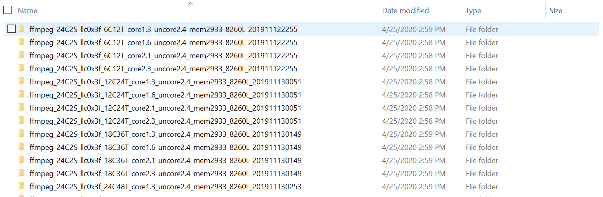
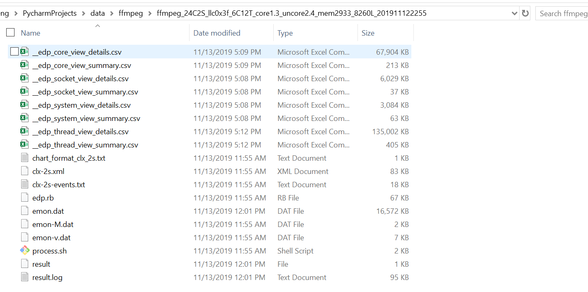

# Performance Analyzer

## Prerequisites

#### 1. backend
* python3
* virtualenv

initialization
```bash
$ pip install virtualenv
$ virtualenv --no-site-packages venv -p python3
# source venv/Scripts/activate
$ source venv/bin/activate
# deactivate
```
```bash
$ source venv/bin/activate
$ pip install numpy==1.17.0
$ pip install PyMySQL==0.9.3
$ pip install SQLAlchemy==1.3.5
$ pip install scipy==1.3.0
$ pip install scikit-learn==0.21.3
$ pip install Flask==1.0.3
$ pip install Flask-Cors==3.0.8
```

#### run
##### Example 1: Create DataBase from original test result (No DataBase exists)

<div align="center">
 
 
</div>

backend/build_database.py
```python
if __name__ == '__main__':
    init_db()
    test_result_rootdir = '../../../data/emon_result'
    load_data_from_rootdir(test_result_rootdir)
    update_tb_config()
```

```bash
$ source venv/bin/activate
$ cd backend
$ python build_database.py                   #create 'data.db'
$ python views.py                            #run
```

##### Example 2: Use the existed DataBase ('data.db' exists)

```bash
$ source venv/bin/activate
$ cd backend
$ python views.py
```

#### 2. frontend
* Vue.js
* Vuetify
* axios
* echarts

initialization
```bash
# 安装 node.js。官网 http://nodejs.org/ ，下载安装即可。
$ node -v
$ npm set registry http://registry.npm.taobao.org                      #切换为淘宝源
$ npm install -g vue-cli@2.9                                           #安装vue.js 2.9版本
$ npm list -g --depth 0                                                #查看已安装的工具包
```
```bash
$ cd frontend
$ npm install
```

#### run
```bash
$ cd frontend
$ npm run dev
```

<br>

## Demo

```bash
$ source venv/bin/activate
$ cd backend
$ python views.py
```

运行信息：
```
* Serving Flask app "views" (lazy loading)
* Environment: production
  WARNING: This is a development server. Do not use it in a production deployment.
  Use a production WSGI server instead.
* Debug mode: off
* Running on http://127.0.0.1:5000/ (Press CTRL+C to quit)
```

```bash
$ cd frontend
$ npm run dev
```

运行信息：
```
> webpack-dev-server --inline --progress --config build/webpack.dev.conf.js

  14% building modules 35/48 modules 13 active ...yzer\data-viewer\frontend\src\App.vue{ parser: "babylon" } is deprecated; we now treat it as { parser: "babel" }.
  95% emitting DONE  Compiled successfully in 10258ms12:47:51 PM

  I  Your application is running here: http://localhost:8080
```
打开浏览器，访问 http://localhost:8080 。

#### 注意： 前端 axios 的 ajax 请求配置，请查看 ``frontend/src`` 目录下的 ``config.js, http.js`` 文件。

config.js
```javascript
const baseUrl = "http://localhost:5000";
```

<br>

## Release

#### 1.编译 Vue 项目
```bash
$ cd frontend
$ npm run build
```

#### 2.将生成的静态资源添加到 backend 工程
```
1. 编译之后，会在 dist 目录下生成 index.html 以及 static 目录。
2. 在 backend 工程目录下创建 templates 目录，并将 index.html 拷贝至 templates 目录。
3. 将 static 目录连同内部文件，拷贝至 backend 工程目录。
```

```bash
$ source venv/bin/activate
$ cd backend
$ python views.py
```

运行结果：
```
* Serving Flask app "views" (lazy loading)
* Environment: production
  WARNING: This is a development server. Do not use it in a production deployment.
  Use a production WSGI server instead.
* Debug mode: off
* Running on http://127.0.0.1:5000/ (Press CTRL+C to quit)
```
打开浏览器，直接访问 http://localhost:5000 。
